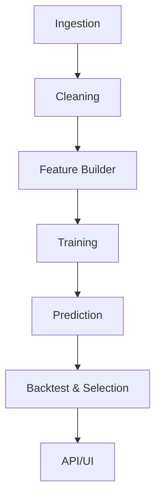

# System Overview

The UFC Win Probability platform ingests public fight data, maintains component-wise Elo ratings, blends them with supervised models, and publishes betting recommendations via API and UI. The system is broken down into five primary layers:

1. **Ingestion** – Scrapers and API clients load historical fights, fighter profiles, upcoming schedules, and odds snapshots. Each ingestor is cache-aware and polite.
2. **Processing** – Normalization modules harmonize entities, enforce schemas, and persist provenance metadata.
3. **Feature Engineering** – Component Elo vectors, division-aware age curves, and matchup features are assembled with leakage guards.
4. **Modeling** – A logistic regression meta-model is calibrated per division and blended with Elo expectations. Artifacts are versioned and stored in `data/models`.
5. **Serving** – FastAPI exposes endpoints, Streamlit delivers dashboards, and APScheduler orchestrates recurring jobs.

## Data Flow

1. `make data` triggers `build_dataset.py` to synthesize or refresh datasets.
2. `make train` fits the classifier, saves metrics, and registers calibration curves.
3. `make predict` loads model artifacts to score upcoming bouts.
4. `make backtest` evaluates bankroll strategies and writes summaries.
5. `make refresh` chains the prior steps and emits fresh EV leaderboards.

All steps emit structured logs, Prometheus metrics, and deterministic artifacts for reproducibility.
